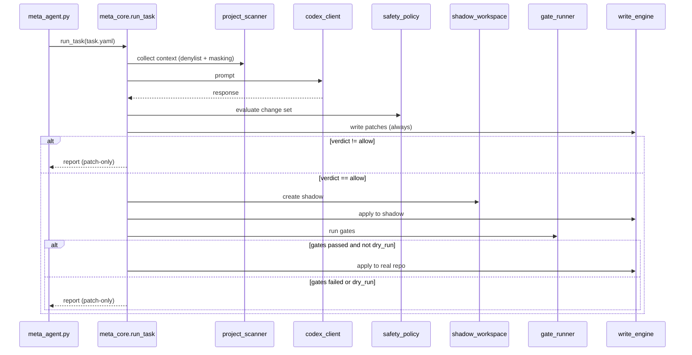
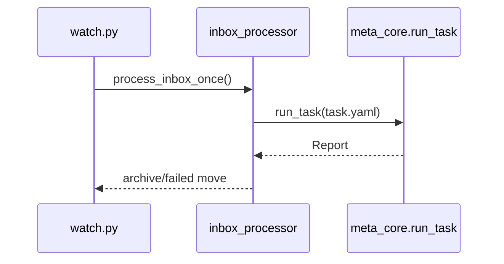

# Meta-Agent Architecture

This document describes the core components, control flow, and single write-path guarantees.

## Components

- `meta_core.run_task`: orchestrates task execution from TaskSpec to report.
- `task_contract`: TaskSpec/Report schema and validation.
- `project_scanner`: collects file context with denylist + secret masking.
- `codex_client`: LLM request abstraction.
- `write_engine`: single apply path for all changes (patch-only or direct).
- `safety_policy`: evaluates change sets and enforces verdicts.
- `shadow_workspace`: creates a shadow copy/worktree for gating.
- `gate_runner`: executes gate steps and captures stdout/stderr.
- `inbox_processor`: batch execution for inbox (used by watch/scheduler).
- `offmarket_scheduler`: windows + trigger + state/recovery/backoff.
- `control_center`: UI + API server + approve/apply workflow.

## Flow 1: run-task (allow -> gated apply)



## Flow 2: watch/inbox batch



## Flow 3: scheduler (windows -> enqueue -> execute -> state)

```mermaid
flowchart TD
    A[Scheduler tick] --> B{STOP/PAUSE?}
    B -->|STOP| Z[Exit]
    B -->|PAUSE| C[Update state only]
    B -->|No| D[Load schedules + state.json]
    D --> E{Within window?}
    E -->|No| C
    E -->|Yes| F{Trigger due?}
    F -->|No| C
    F -->|Yes| G[Enqueue task.yaml in inbox]
    G --> H[process_inbox_once()]
    H --> I[Update state.json + backoff]
```

## Single write-path guarantee

All writes are routed through `write_engine.apply_change_set_with_policy`.
This enforces safety policy verdicts and ensures patch-only mode is respected.
No stage pipeline or UI action bypasses this path, so warn/block never apply.
The approve/apply path reuses the same write engine and safety checks.
