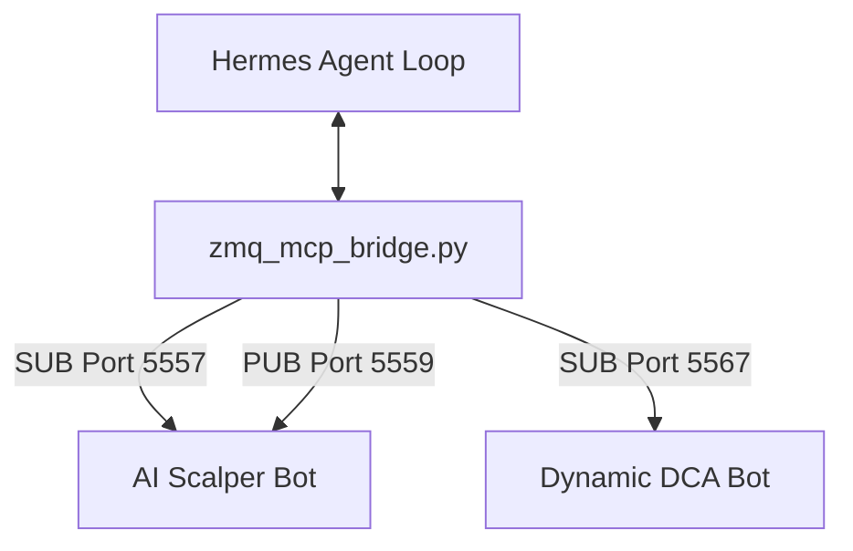

# FULL CONTEXT: HERMES AGENT CODEBASE

This document provides a technical audit and architectural breakdown of the Hermes Agent codebase located at `/home/korben/QuantumEdge-main/hermes_agent/`. It explains the directory structure, execution entry points, and integration points with the QuantumEdge HFT trading platform.

---

## 1. Directory Structure Audit

The `hermes_agent/` directory is a local development copy of the Nous Research Hermes Agent codebase. It is organized as a modular, extensible framework for running multi-modal, agentic reasoning loops with local and cloud LLMs.

### Root Directory Layout
*   `run_agent.py`: The primary entry point for starting the agent. Loads config, initializes environments, checks dependencies, and launches the execution loops.
*   `cli.py`: Main Command Line Interface wrapper allowing commands like `hermes start`, `hermes run`, and execution status monitoring.
*   `mcp_serve.py`: Implements Model Context Protocol (MCP) server endpoints, enabling LLMs to execute system actions or query structured tools.
*   `zmq_mcp_bridge.py`: Custom-built integration bridge for the QuantumEdge HFT platform. Connects to bot telemetry streams and command buses.
*   `pyproject.toml` & `setup.py`: Packaging configurations defining python dependencies and CLI binaries.
*   `uv.lock` & `package.json`: Lockfile and metadata for packages.

### Subdirectories
*   `agent/`: The core reasoning and implementation logic.
    *   `conversation_loop.py`: Implements the core agent loop (turn budget, tool calls execution, structured output parsing).
    *   `agent_init.py` & `agent_runtime_helpers.py`: Controls agent setup, state initialization, and helper functions.
    *   `prompt_builder.py`: Dynamically builds system prompts by injecting skills, memories, context parameters, and conversation history.
    *   `context_compressor.py` & `context_engine.py`: Manages the agent's context window by automatically summarizing or archiving older messages.
    *   `tool_executor.py` & `tool_guardrails.py`: Safe execution layer for files, terminal commands, and network APIs.
    *   `model_metadata.py`: Catalog of pricing, context limits, and capabilities of different model endpoints.
    *   `google_oauth.py`: OAuth client for Google Cloud / Vertex AI integration.
    *   Adapters (`anthropic_adapter.py`, `gemini_native_adapter.py`, `bedrock_adapter.py`, etc.): Custom client wrappers for standard LLM APIs.
*   `skills/`: Bundled skill templates and instructions (e.g. `devops`, `github`, `mcp`, `productivity`, `research`).
*   `plugins/`: Extensible integration plugins for custom hooks, databasing, and CLI utilities.
*   `providers/`: Model provider configurations and base client engines.
*   `tests/`: Unit and integration tests for the agent core (such as model adapters, compression, and oauth flow).

---

## 2. QuantumEdge Integration Mechanics

The local Hermes agent codebase features dedicated integration layers to supervise and control the QuantumEdge HFT trading bots.

### ZMQ MCP Bridge (`zmq_mcp_bridge.py`)
This script acts as the communication adapter between Hermes and the trading engine:
1.  **Status Auditing (`status` command)**: Connects via ZMQ SUB sockets to the telemetry channels of the HFT bots:
    *   `tcp://127.0.0.1:5557` (AI Scalper telemetry)
    *   `tcp://127.0.0.1:5567` (Dynamic DCA telemetry)
    It aggregates the latest telemetry JSON envelopes (PnL, position drawdowns, running modes, latency) and prints them in a unified format for the agent to parse.
2.  **Policy Injection (`policy` command)**: Establishes a ZMQ PUB connection on `tcp://127.0.0.1:5559` to broadcast policy updates under the topic `command.<bot_id>`. Directives include adjusting risk multipliers (`risk_multiplier`), max price levels (`buy_zone_max`), trading modes (`SCALP`, `DCA`), or pausing/stopping the bots entirely.

---

## 3. Core Operating Principles

The agent operates on an autonomous **Observe-Orient-Decide-Act (OODA)** cycle:
1.  **Observe**: Through MCP bridges and tool execution, the agent gathers system logs (`bot.log`), database trend metrics from QuestDB, and real-time orderbook snapshots from ZMQ.
2.  **Orient**: The agent filters signals using pre-defined risk policies (`risk_policy.md`) and calculates system health, such as drawdown percentages or latency desynchronization.
3.  **Decide**: The LLM reasoning engine (e.g. Gemini 3.5 or Stepfun) evaluates the system state against trading constraints (e.g. "No-Loss" rules).
4.  **Act**: If parameters are violated, the agent executes commands via `zmq_mcp_bridge.py` to adapt strategy parameters or triggers diagnostic repairs. Technical code updates or testing are delegated to **Antigravity (agy)**.
